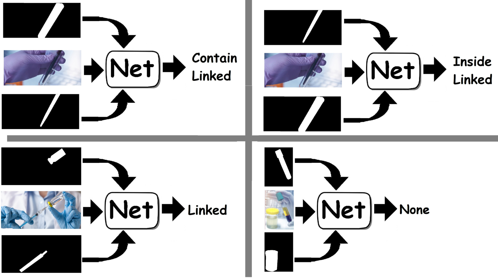
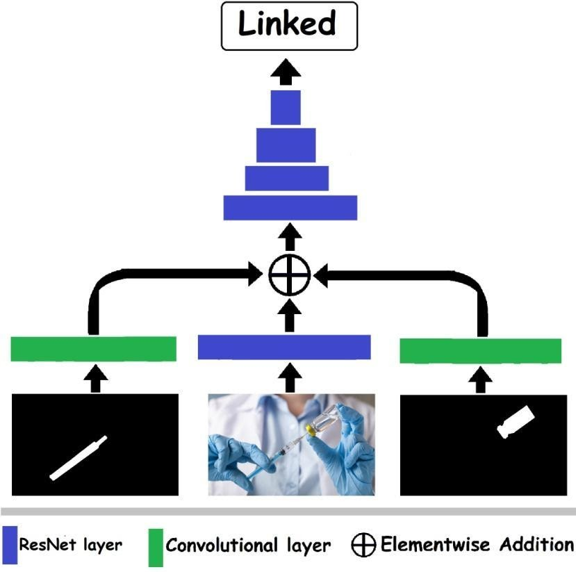

# Finding relations between two instances in an image using a convolutional neural net.
## Given an image and two masks of two vessels in the image, the net return the relation between the vessels (inside/contain/linked)

Figure 1) Predicting relationships between vessels. The net receives the image and masks of the two vessels and predicts the relationship. A 'linked' relationship means that there is a connection that allows liquid to pass between the two vessels, while 'inside' or 'contain' means that one vessel contains the other.

See paper [Computer vision for liquid samples in hospitals and medical labs using hierarchical image segmentation]() for details.

A trained and ready to run model can be download from [here](https://drive.google.com/file/d/1Zl_czgm4NRpz-JisYgvGLfZBnwX_vNAl/view?usp=sharing).

The net is designed to work with the LabPics medical/chemical datasets that can be downloaded from [here](https://zenodo.org/record/4736111) or [here](https://www.kaggle.com/sagieppel/labpics-chemistry-labpics-medical)

# Requirements
## Hardware
For using the trained net for prediction, no specific hardware is needed, but the net will run much faster on Nvidia GPU.

For training the net, an Nvidia GPU is needed (the net was trained on Titan XP 16GB)

## Software:
This network was run with Python 3.7 [Anaconda](https://www.anaconda.com/download/) with  [Pytorch](https://pytorch.org/) and OpenCV package.

# Setup for running prediction
1) Install [Anaconda](https://www.anaconda.com/download/)
2) Create a virtual environment with the required dependencies ([Pytorch](https://pytorch.org/), torchvision, scipy and OpenCV): *conda env create -f environment.yml*
3) Activate the virtual environment: *conda activate vessel-segmentation*
4) Download the code with trained model weight from [here](https://drive.google.com/file/d/1Zl_czgm4NRpz-JisYgvGLfZBnwX_vNAl/view?usp=sharing).

# Running Example prediction on one image and one vessel mask
1. Download pretrained model from [here](https://drive.google.com/file/d/1Zl_czgm4NRpz-JisYgvGLfZBnwX_vNAl/view?usp=sharing) or train net using the instruction in the Training section
2. Open RunExample.py
3. Set pretrained model path to the Trained_model_path parameter. Should already be set if using pretrained model.
4. Set the input image file path to TestImage parameter or leave it as is and use the example image supplied with this code.
5. Set the input first Vessel mask file path to TestMask1 parameter or leave it as is and use the example mask supplied with this code. 
6. Set the input second Vessel mask file path to TestMask2 parameter or leave it as is and use the example mask supplied with this code. 
7. Set output folder to the OutDir parameter (or leave as is)
8. Run script. The output will appear on the screen and be saved in the OutDir folder.

# Training the net
Train.py script should run out of the box with the example training data in this folder.

1. Download the LabPics dataset from [here](https://zenodo.org/record/4736111) or [here](https://www.kaggle.com/sagieppel/labpics-chemistry-labpics-medical)
2. Open the Train.py script
3. Set the path to the LabPics chemistry train set into the  ChemLabPicsDir parameter.
4. Set the path to the LabPics medical train set into the MedLabPicsDir parameter.
5. Run the script 
6. Output trained model will appear in the /log subfolder or any folder set in the Trained_model_Path parameter.
7. For additional training parameters, see "Input parameters" section in TRAIN.py

# Evaluating results:
Run prediction on the LabPics test set.

1. Download pretrained model from [here](https://drive.google.com/file/d/1Zl_czgm4NRpz-JisYgvGLfZBnwX_vNAl/view?usp=sharing) or train net using the instruction in the Training section
2. Download the LabPics dataset from [here](https://zenodo.org/record/4736111) or [here](https://www.kaggle.com/sagieppel/labpics-chemistry-labpics-medical)
4. Open Evaluate.py script
5. Set the LabPics test set folder path to the EvaluateInputDir parameter or leave it as is for running on example images.
6. Set pretrained model path to the Trained_model_path parameter. Should already be set if using pretrained model.
7. Run script.
8. The results would be printed on screen

## Example Results
Some examples are shown in Figure 2.

Figure 2:Predicting the relationships between two instance classes. The prediction was generated using a modified ResNet for image classification, with the addition of the two vessel masks as inputs. Each vessel mask was processed using a separate convolution layer, and the output of these layers was added to the feature map after the first ResNet layer.

## Net architecture and training details
The relationships between two vessels (Figure 1) were identified using modified neural nets for image classification (ResNet). The image and the masks of the two vessels were used as inputs to the net (Figure 2). The vessel masks were processed using a separate convolutional layer (a single layer for each mask), and the output feature maps were added (elementwise) to the feature map produced by the image after the first ResNet layer (Figure 2). The relationships were limited to three classes: 'inside', 'contain', and 'linked'. Each class was predicted independently in the form of two values, which after normalization using Softmax give the probability that the class exists or not. The 'inside' and 'contain' relations were interchangeable: replacing the order of the masks changed the prediction from 'inside' to 'contain', and vice versa (Figure 5). The training was carried out on each pair of vessels in each image. The choice of pairs for each training batch was made randomly with equal probability for each relationship class (to ensure class balance).
